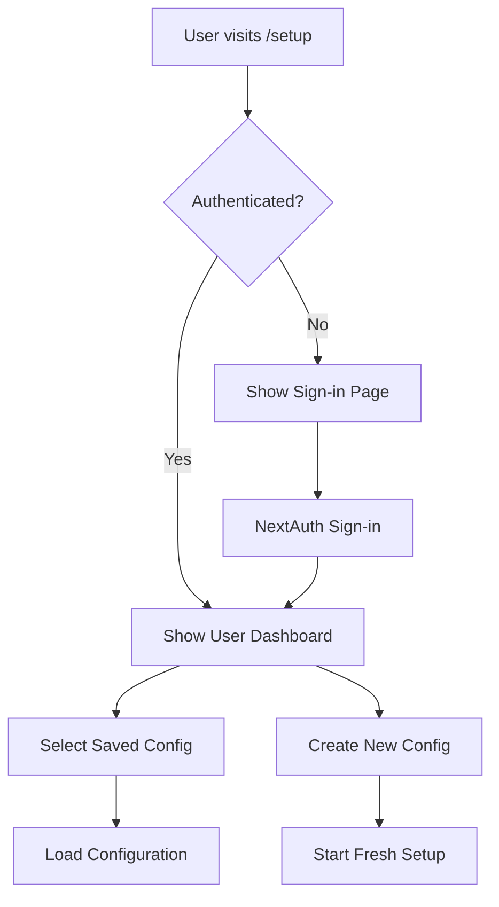
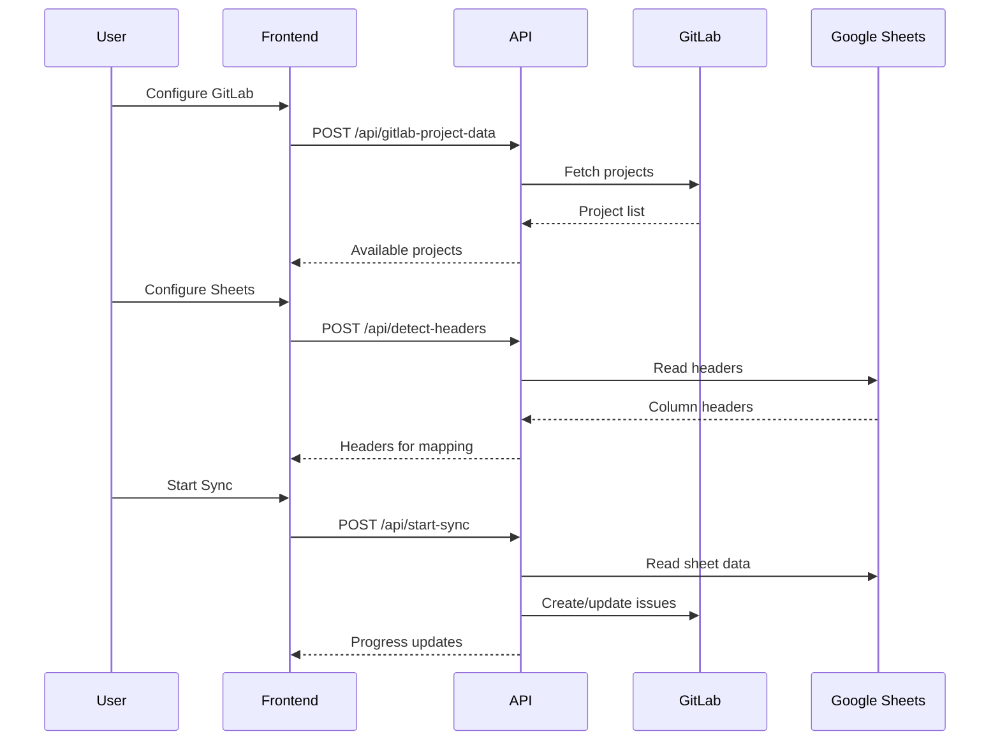

# Sheet Ninja Setup System - How It Works

## Overview

Sheet Ninja is a comprehensive synchronization tool that connects Google Sheets with GitLab issues. The setup system is built with Next.js, React, and modern UI components to provide a seamless configuration experience.

## Architecture

### Core Technologies
- **Frontend**: Next.js 15 with App Router
- **UI Components**: shadcn/ui with Tailwind CSS
- **State Management**: React hooks and context
- **Authentication**: NextAuth.js
- **Database**: Prisma with MySQL
- **API**: Next.js API routes

### File Structure
```
src/app/setup/
├── page.js                    # Main setup page with state management
└── HOW_IT_WORKS.md           # This documentation

src/components/setup/
├── GitLabConfig.js           # GitLab connection configuration
├── SheetsConfig.js           # Google Sheets configuration
├── ColumnMapping.js          # Column mapping interface
├── ProjectMapping.js         # Project mapping management
├── SyncRunner.js             # Synchronization execution
├── ProgressSteps.js          # Progress indicator component
└── useStepTransition.js      # Step transition hook

src/components/
├── UserDashboard.js          # User configuration dashboard
├── SaveConfigDialog.js       # Configuration saving dialog
└── ErrorBoundary.js          # Error handling component
```

## System Flow

### 1. Authentication & Dashboard


### 2. Configuration Steps
The setup process follows a 5-step workflow:

#### Step 1: GitLab Configuration
- **Purpose**: Connect to GitLab instance
- **Components**: `GitLabConfig.js`
- **Features**:
  - GitLab URL configuration
  - Personal access token input
  - Project fetching and validation
  - Available projects display

```javascript
// Key functionality
const fetchAvailableProjects = async () => {
  const response = await fetch('/api/gitlab-project-data', {
    method: 'POST',
    body: JSON.stringify({
      gitlabUrl: config.gitlabUrl,
      gitlabToken: config.gitlabToken,
    }),
  });
  // Updates config with available projects
};
```

#### Step 2: Google Sheets Configuration
- **Purpose**: Connect to Google Sheets
- **Components**: `SheetsConfig.js`
- **Features**:
  - Service account JSON upload
  - Spreadsheet ID input
  - Sheet name detection
  - Column header detection

```javascript
// Service account handling
const handleServiceAccountFile = (file) => {
  const reader = new FileReader();
  reader.onload = (e) => {
    const parsed = JSON.parse(e.target.result);
    updateConfig({ serviceAccount: parsed });
  };
  reader.readAsText(file);
};
```

#### Step 3: Column Mapping
- **Purpose**: Map spreadsheet columns to data fields
- **Components**: `ColumnMapping.js`
- **Features**:
  - Auto-mapping with intelligent matching
  - Manual column selection
  - Required vs optional field validation
  - Saved mapping restoration

```javascript
// Auto-mapping logic
const findBestMatch = (targetHeader, headers) => {
  // Exact matches first
  for (let i = 0; i < headers.length; i++) {
    if (headers[i].toLowerCase().trim() === targetLower) {
      return i + 1;
    }
  }
  // Partial matches for common variations
  // ... intelligent matching logic
};
```

#### Step 4: Project Mapping
- **Purpose**: Configure individual project settings
- **Components**: `ProjectMapping.js`
- **Features**:
  - Project name detection from sheets
  - GitLab project selection
  - Assignee, milestone, and label configuration
  - Custom project addition

```javascript
// Project-specific data fetching
const fetchProjectSpecificData = async (projectMappingId, gitlabProjectId) => {
  const response = await fetch('/api/project-data', {
    method: 'POST',
    body: JSON.stringify({
      gitlabUrl: config.gitlabUrl,
      gitlabToken: config.gitlabToken,
      projectId: gitlabProjectId,
    }),
  });
  // Updates project with labels, milestones, assignees
};
```

#### Step 5: Synchronization
- **Purpose**: Execute the sync process
- **Components**: `SyncRunner.js`
- **Features**:
  - Real-time progress tracking
  - Date filtering options
  - Status-based issue closing
  - Output monitoring

```javascript
// Sync execution
const startSync = async () => {
  const syncData = {
    gitlabUrl: config.gitlabUrl,
    gitlabToken: config.gitlabToken,
    spreadsheetId: config.spreadsheetId,
    projectMappings: projectMappings,
    columnMappings: config.columnMappings
  };
  
  const response = await fetch('/api/start-sync', {
    method: 'POST',
    body: JSON.stringify(syncData),
  });
};
```

## State Management

### Configuration State
The main setup page manages comprehensive configuration state:

```javascript
const [config, setConfig] = useState({
  // GitLab settings
  gitlabUrl: 'https://sourcecontrol.hsenidmobile.com/api/v4/',
  gitlabToken: '',
  projectId: '',
  
  // Google Sheets settings
  spreadsheetId: '',
  worksheetName: 'Sheet1',
  serviceAccount: null,
  
  // Column mappings
  columnMappings: {},
  
  // Project mappings
  projectMappings: [],
  
  // Defaults
  defaultAssignee: '',
  defaultMilestone: '',
  defaultLabel: '',
  defaultEstimate: '8h'
});
```

### Project Mappings State
Individual project configurations:

```javascript
const [projectMappings, setProjectMappings] = useState([
  {
    id: 'unique-id',
    projectName: 'Project Alpha',
    projectId: 'gitlab-project-id',
    assignee: 'username',
    milestone: 'milestone-id',
    labels: ['label1', 'label2'],
    estimate: '8h',
    projectData: {
      labels: [...],
      milestones: [...],
      assignees: [...]
    }
  }
]);
```

## API Integration

### Backend API Routes
The system communicates with several API endpoints:

- `/api/gitlab-project-data` - Fetch GitLab projects
- `/api/sheet-names` - Get Google Sheets worksheet names
- `/api/detect-headers` - Detect column headers
- `/api/sheet-project-names` - Extract project names from sheets
- `/api/project-data` - Get project-specific data (labels, milestones, assignees)
- `/api/start-sync` - Begin synchronization
- `/api/sync-status` - Check sync progress
- `/api/stop-sync` - Stop running sync
- `/api/user/configs` - Manage saved configurations

### Data Flow


## Key Features

### 1. Intelligent Column Mapping
- **Auto-detection**: Automatically maps columns based on header names
- **Smart matching**: Handles variations in naming conventions
- **Manual override**: Users can manually adjust mappings
- **Validation**: Ensures required fields are mapped

### 2. Project-Specific Configuration
- **Dynamic loading**: Fetches project-specific data (assignees, milestones, labels)
- **Custom settings**: Each project can have unique settings
- **Bulk operations**: Apply defaults across multiple projects

### 3. Real-time Synchronization
- **Progress tracking**: Visual progress indicators
- **Live output**: Real-time sync output display
- **Error handling**: Comprehensive error reporting
- **Status management**: Start, stop, and monitor sync operations

### 4. Configuration Management
- **Save/Load**: Save configurations for reuse
- **Default settings**: Set default configurations
- **Version control**: Track configuration changes
- **Encryption**: Secure credential storage

## User Experience

### Step-by-Step Guidance
1. **Visual Progress**: Clear step indicators
2. **Validation**: Real-time configuration validation
3. **Help Text**: Contextual help and instructions
4. **Error Messages**: Clear error reporting

### Responsive Design
- **Mobile-friendly**: Works on all device sizes
- **Accessible**: WCAG compliant components
- **Modern UI**: Clean, intuitive interface

## Security Features

### Credential Management
- **Encrypted storage**: Sensitive data is encrypted
- **Secure transmission**: HTTPS for all communications
- **Token management**: Secure handling of API tokens

### Access Control
- **Authentication**: NextAuth.js integration
- **User isolation**: Users can only access their configurations
- **Session management**: Secure session handling

## Error Handling

### Frontend Error Handling
```javascript
// Error boundary for component errors
<ErrorBoundary>
  <SetupComponent />
</ErrorBoundary>

// API error handling
try {
  const response = await fetch('/api/endpoint');
  if (!response.ok) {
    throw new Error(`HTTP error! status: ${response.status}`);
  }
} catch (error) {
  toast.error('Operation failed: ' + error.message);
}
```

### Backend Error Handling
- **Validation**: Input validation and sanitization
- **Logging**: Comprehensive error logging
- **Recovery**: Graceful error recovery

## Performance Optimizations

### Frontend Optimizations
- **Lazy loading**: Components loaded on demand
- **Memoization**: React.memo for expensive components
- **Debouncing**: Input debouncing for API calls
- **Caching**: Local storage for configuration data

### Backend Optimizations
- **Connection pooling**: Database connection optimization
- **Caching**: API response caching
- **Batch operations**: Bulk data processing
- **Async processing**: Non-blocking operations

## Testing Strategy

### Component Testing
- **Unit tests**: Individual component testing
- **Integration tests**: Component interaction testing
- **E2E tests**: Full workflow testing

### API Testing
- **Endpoint testing**: API route validation
- **Error scenarios**: Error condition testing
- **Performance testing**: Load and stress testing

## Deployment Considerations

### Environment Configuration
- **Environment variables**: Secure configuration management
- **Database setup**: Prisma migration handling
- **Service accounts**: Google Sheets API configuration

### Monitoring
- **Error tracking**: Comprehensive error monitoring
- **Performance metrics**: Application performance monitoring
- **User analytics**: Usage pattern analysis

## Future Enhancements

### Planned Features
- **Bulk operations**: Mass configuration management
- **Templates**: Pre-built configuration templates
- **Scheduling**: Automated sync scheduling
- **Notifications**: Email/Slack notifications
- **Analytics**: Detailed sync analytics

### Technical Improvements
- **TypeScript**: Full TypeScript migration
- **State management**: Redux/Zustand integration
- **Testing**: Comprehensive test coverage
- **Documentation**: API documentation generation

## Troubleshooting

### Common Issues
1. **Authentication failures**: Check GitLab token permissions
2. **Sheet access issues**: Verify service account permissions
3. **Column mapping problems**: Check header names and formats
4. **Sync failures**: Review error logs and configuration

### Debug Tools
- **Browser console**: Frontend debugging
- **Network tab**: API call monitoring
- **Server logs**: Backend error tracking
- **Database queries**: Data validation

This documentation provides a comprehensive overview of how the Sheet Ninja setup system works, from user interaction to backend processing. The system is designed to be robust, user-friendly, and scalable for various synchronization needs.
