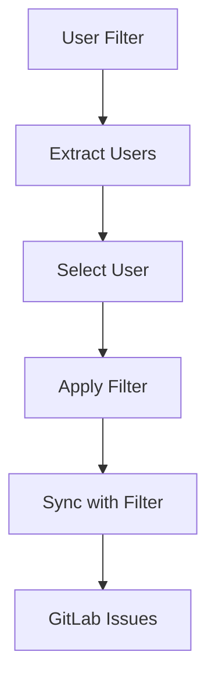

# Sheet Ninja v2 - Advanced Setup System

## Overview

Sheet Ninja v2 is a completely rewritten, efficient setup system built with modern technologies and best practices. It provides a streamlined experience for configuring GitLab and Google Sheets synchronization with advanced features like user filtering.

## Key Improvements

### 🚀 **Performance & Efficiency**
- **Zustand State Management**: Lightweight, fast state management
- **Component-based Architecture**: Modular, reusable components
- **Optimized Code**: Fewer lines, better structure, easier to understand
- **TypeScript**: Full type safety throughout the application

### 🎯 **Enhanced Features**
- **User Filter**: Filter synchronization by specific users from Google Sheets
- **Smart Column Mapping**: Intelligent auto-mapping with manual override
- **Real-time Notifications**: Toast-based notification system
- **Progress Tracking**: Visual step-by-step progress indicators

### 🏗️ **Architecture**

#### State Management
```typescript
// Centralized state with Zustand
const { 
  currentStep, 
  gitlab, 
  sheets, 
  columnMappings, 
  projectMappings,
  updateGitLab,
  updateSheets,
  // ... more actions
} = useSetupStore();
```

#### Component Structure
```
src/components/v2/
├── GitLabConfig.tsx      # GitLab connection
├── SheetsConfig.tsx      # Google Sheets setup
├── ColumnMapping.tsx     # Column mapping with auto-detection
├── ProjectMapping.tsx    # Project configuration
├── UserFilter.tsx        # User filtering (NEW)
└── SyncRunner.tsx         # Synchronization execution
```

## Setup Flow

### 6-Step Process
1. **GitLab Configuration** - Connect to GitLab instance
2. **Google Sheets Setup** - Configure service account and detect sheets
3. **Column Mapping** - Map spreadsheet columns to data fields
4. **Project Mapping** - Configure individual project settings
5. **User Filter** - Optional user-based filtering
6. **Synchronization** - Execute the sync process

### Key Features

#### 1. Intelligent Column Mapping
- **Auto-detection**: Automatically maps columns based on header names
- **Smart matching**: Handles variations in naming conventions
- **User column support**: Special handling for user filtering
- **Validation**: Ensures required fields are mapped

#### 2. User Filtering (NEW)
- **Extract users**: Automatically extract unique users from sheets
- **Filter by user**: Synchronize only specific user's data
- **Optional step**: Can be skipped for full synchronization
- **Real-time extraction**: Live user list from your data

#### 3. Enhanced Project Management
- **Dynamic loading**: Fetches project-specific data (assignees, milestones, labels)
- **Custom projects**: Add projects not found in sheets
- **Bulk operations**: Apply defaults across multiple projects
- **Visual feedback**: Clear status indicators

#### 4. Real-time Synchronization
- **Progress tracking**: Visual progress indicators
- **Live output**: Real-time sync output display
- **Error handling**: Comprehensive error reporting
- **Status management**: Start, stop, and monitor sync operations

## Technical Implementation

### State Management with Zustand
```typescript
// Setup store with comprehensive state
interface SetupState {
  currentStep: number;
  gitlab: GitLabConfig;
  sheets: SheetsConfig;
  columnMappings: ColumnMapping;
  projectMappings: ProjectMapping[];
  syncConfig: SyncConfig;
  loading: LoadingState;
  // ... actions
}
```

### Efficient Components
- **Single Responsibility**: Each component handles one specific task
- **Reusable Logic**: Shared hooks and utilities
- **Type Safety**: Full TypeScript integration
- **Error Boundaries**: Graceful error handling

### User Filter Implementation
```typescript
// Extract users from Google Sheets
const extractUsers = async () => {
  const response = await fetch('/api/sheet-user-names', {
    method: 'POST',
    body: JSON.stringify({
      spreadsheetId: sheets.spreadsheetId,
      worksheetName: sheets.worksheetName,
      userColumn: columnMappings.USER,
      serviceAccount: sheets.serviceAccount,
    }),
  });
  // Process and store unique users
};
```

## API Integration

### New Endpoints
- `/api/sheet-user-names` - Extract unique users from sheets
- Enhanced existing endpoints with user filtering support

### Data Flow


## Usage

### Basic Setup
1. Navigate to `/v2`
2. Follow the 6-step process
3. Configure GitLab and Google Sheets
4. Map columns and projects
5. Optionally filter by user
6. Run synchronization

### User Filtering
1. Map a USER column in step 3
2. Go to step 5 (Filter)
3. Extract users from your sheet
4. Select a specific user to filter by
5. Apply the filter before syncing

## Benefits

### For Developers
- **Maintainable**: Clean, organized code structure
- **Extensible**: Easy to add new features
- **Type Safe**: Full TypeScript support
- **Testable**: Component-based testing

### For Users
- **Intuitive**: Clear step-by-step process
- **Efficient**: Faster setup and configuration
- **Flexible**: User filtering and custom options
- **Reliable**: Better error handling and feedback

## Migration from v1

### Key Differences
- **State Management**: Zustand instead of React state
- **Component Structure**: More modular and reusable
- **User Filtering**: New feature for targeted sync
- **TypeScript**: Full type safety
- **Performance**: Optimized for speed and efficiency

### Backward Compatibility
- Same API endpoints
- Same configuration format
- Enhanced with new features
- Improved user experience

## Future Enhancements

### Planned Features
- **Bulk User Operations**: Manage multiple users
- **Advanced Filtering**: Date ranges, status filters
- **Templates**: Pre-built configuration templates
- **Scheduling**: Automated sync scheduling
- **Analytics**: Detailed sync analytics

### Technical Improvements
- **Testing**: Comprehensive test coverage
- **Documentation**: API documentation generation
- **Performance**: Further optimizations
- **Accessibility**: Enhanced a11y features

## Getting Started

1. **Install Dependencies**: All required packages are already installed
2. **Navigate to v2**: Visit `/v2` to access the new setup system
3. **Follow the Process**: Complete the 6-step setup process
4. **Use User Filtering**: Take advantage of the new user filtering feature
5. **Run Sync**: Execute synchronization with your configured settings

The v2 implementation provides a modern, efficient, and user-friendly experience for setting up GitLab and Google Sheets synchronization with advanced filtering capabilities.
